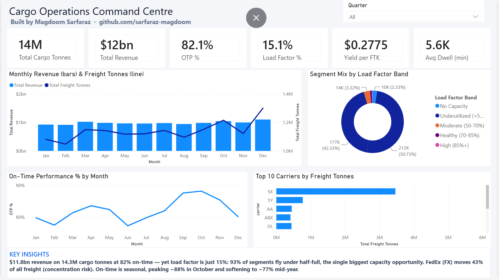
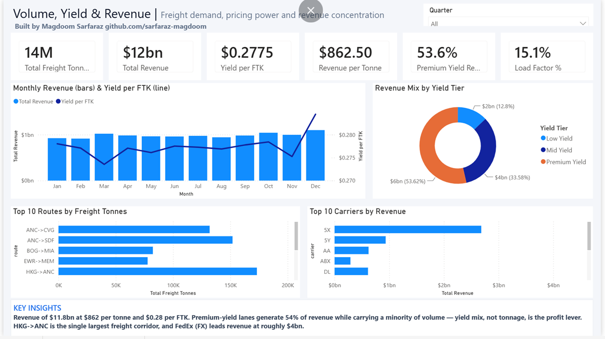
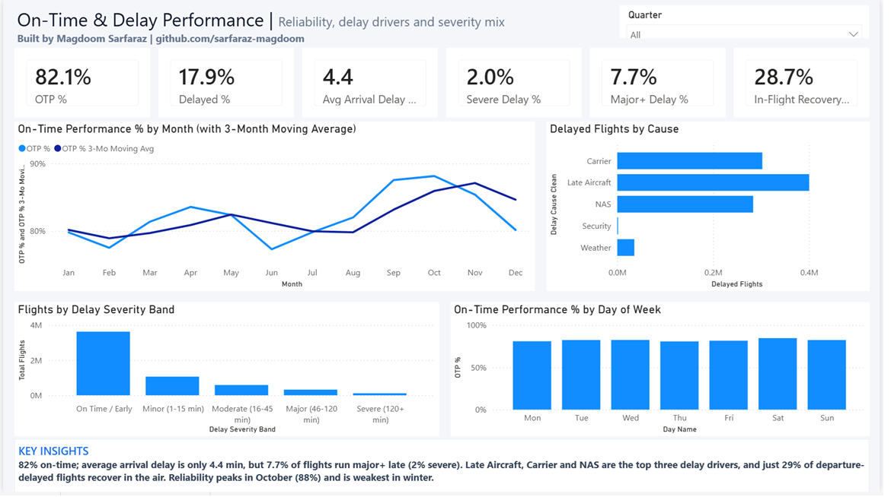
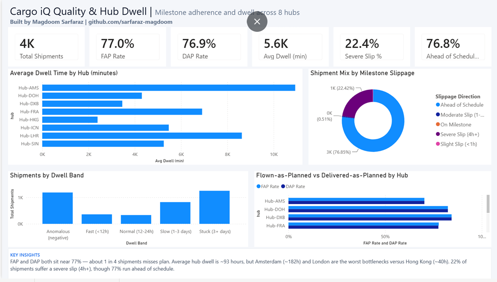
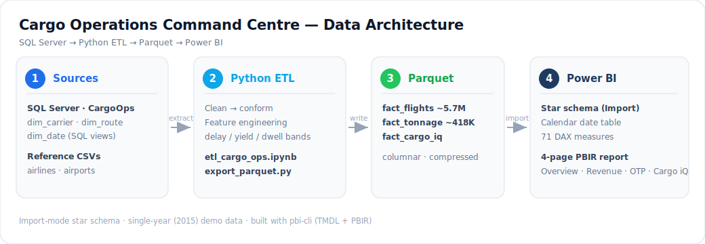

# ✈️ Cargo Operations Command Centre — Power BI Executive Dashboard

An end‑to‑end **data‑engineering + analytics** project: a SQL → Python → Parquet → Power BI pipeline feeding a 4‑page executive dashboard that turns ~5.7M air‑cargo movements into decision‑ready KPIs, trends and insights.

> **Stack:** SQL Server · Python (pandas / pyarrow) · Parquet · Power BI (star‑schema model, 71 DAX measures, PBIR enhanced report format)

---

## 📸 Dashboard

| Executive Overview | Volume, Yield & Revenue |
|---|---|
|  |  |
| **On‑Time & Delay Performance** | **Cargo iQ Quality & Hub Dwell** |
|  |  |

🔗 **Live report:** _(add your Power BI “Publish to web” link here)_

---

## 🎯 What it answers

A cargo/airline operations leader needs one place to see **how much moved, how much it earned, how reliably it ran, and how cleanly it flowed through hubs.** This dashboard covers all four:

1. **Executive Overview** – headline KPIs (cargo tonnes, revenue, OTP, load factor, yield, dwell), monthly revenue + tonnage trend, load‑factor mix, top carriers.
2. **Volume, Yield & Revenue** – revenue/yield KPIs, monthly revenue + yield, revenue by yield tier, top routes & carriers.
3. **On‑Time & Delay Performance** – OTP trend + 3‑month moving average, delay causes, severity bands, weekday reliability.
4. **Cargo iQ Quality & Hub Dwell** – FAP/DAP milestone adherence, dwell by hub, slippage mix, dwell bands.

Each page ends with a data‑driven **Key Insights** bar.

---

## 🏗️ Architecture



---

## 🧱 Data model (star schema)

| Table | Role | Notes |
|---|---|---|
| `fact_flights` | Fact | ~5.7M rows — on‑time / delay performance, delay cause & severity bands |
| `fact_tonnage` | Fact | ~418K rows — freight/mail tonnes, FTK/AFTK, revenue, load‑factor & yield tiers |
| `fact_cargo_iq` | Fact | Cargo iQ milestones — dwell, slippage, FAP/DAP across 8 hubs |
| `Calendar` | Dim | Marked date table; `Month`/`Quarter`/`Day Name` have sort‑by columns |
| `dim_carrier` | Dim | Carrier lookup |
| `dim_route` | Dim | Route (origin → dest) |
| `airports` | Dim | IATA, city, country, lat/long |
| `DimAirlines` | Dim | Airline names |

**71 measures** organised into display folders: Volume & Tonnage · On‑Time Performance · Load Factor & Capacity · Yield & Revenue · Hub Dwell & Milestones · Time Intelligence · Rankings · Delay Diagnostics · Utilization Mix · Cargo iQ Quality.

---

## 🔎 Selected insights (FY2015)

- **$11.8bn** revenue on **14.3M** cargo tonnes at **82%** on‑time — but **load factor is only 15%**: 93% of segments fly under half‑full (the biggest capacity opportunity).
- **Concentration:** FedEx (FX) moves **43%** of all freight and leads revenue (~$4bn).
- **Yield mix is the profit lever:** premium‑yield lanes drive **54%** of revenue on minority volume.
- **Delay drivers:** Late Aircraft, Carrier and NAS; only **29%** of delayed departures recover in the air; OTP peaks ~88% in October.
- **Hub bottlenecks:** average dwell ~93h, with **Amsterdam (~182h)** and London the worst vs Hong Kong (~40h).

---

## 🛠️ Reproduce locally

```bash
# 1. Restore/prepare the source data in SQL Server (CargoOps) and reference CSVs
# 2. Run the ETL to produce Parquet fact tables
jupyter notebook etl_cargo_ops.ipynb        # clean + conform + feature-engineer
python export_parquet.py                     # write /data/parquet/*

# 3. Open the Power BI project
#    Open "Cargo Operations Dashboard.pbip" in Power BI Desktop
#    (enable Preview: File > Options > Preview features > "Power BI Project (.pbip)" + PBIR)
```

> The 902 MB `data/` folder and `.pbix` binaries are **git‑ignored** — the pipeline regenerates them. The committed source of truth is the **`.pbip` project** (TMDL semantic model + PBIR report) plus the ETL code.

---

## 📁 Repository structure

```
cargo-ops-dashboard/
├─ Cargo Operations Dashboard.pbip          # Power BI project entry point
├─ Cargo Operations Dashboard.SemanticModel/ # TMDL model: tables, relationships, 71 DAX measures
├─ Cargo Operations Dashboard.Report/        # PBIR report: 4 pages of visuals (JSON)
├─ etl_cargo_ops.ipynb                        # main ETL notebook
├─ export_parquet.py                          # write columnar Parquet fact tables
├─ all_views.sql                              # SQL Server dimension views
└─ docs/screenshots/                          # dashboard images for this README
```

---

## 📌 Data provenance

Built on the public **2015 U.S. flight‑performance dataset** (flights, airlines, airports), reframed as an air‑cargo operation and **augmented with synthesized** cargo tonnage, revenue/yield and Cargo iQ milestone data for portfolio/demonstration purposes. No proprietary or personal data is used.

---

## 👤 Author

**Magdoom Sarfaraz** — Data / Analytics Engineering
🔗 GitHub: [github.com/sarfaraz-magdoom](https://github.com/sarfaraz-magdoom)
_(add your LinkedIn link here)_
